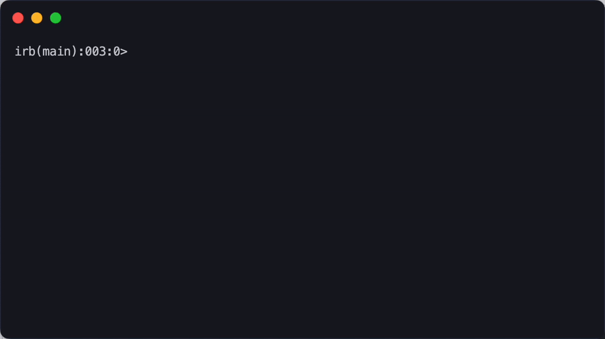

# donut

Viewer for `.txt` or `.ascii` output by [charmbracelet/vhs](https://github.com/charmbracelet/vhs) 🍩

This image uses [charmbracelet/vhs example file](https://github.com/charmbracelet/vhs/tree/main/examples/cli-ui/text-prompt.ascii) as an example.

## Installation

`$ go install github.com/lusingander/donut@latest`

## Usage

Input a [file generated by the vhs, either in .txt or .ascii format](https://github.com/charmbracelet/vhs#continuous-integration), via stdin.

`$ donut < output.ascii`

### Keybindings

|Key|Description|
|-|-|
|<kbd>j</kbd>|next page|
|<kbd>k</kbd>|prev page|
|<kbd>Tab</kbd>|switch mode|
|<kbd>Ctrl+C</kbd> <kbd>Esc</kbd>|quit|

## License

MIT
